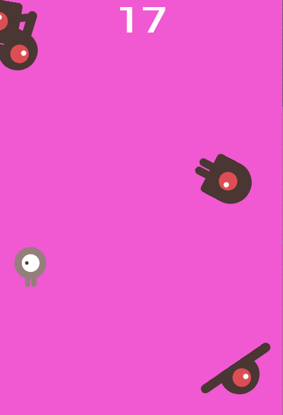

# 2D Game from the Godot Tutorial

This is the first Godot game I buidl, based on a tutorial from Godot. The project demonstrates the fundamentals of creating a 2D game, including player movement, animations, collisions, and level design.
The link to the online tutorial I used: https://docs.godotengine.org/en/stable/getting_started/first_2d_game/index.html

## Features

    2D Player Movement: Move up, down, left right.
    Animations: Basic character animations moving in different directions, enemies movemen.
    Collectibles: Time survived without solliding with one of the enemies.
    Basic UI: A score counter for tracking the survived time.
    Sounds: Background music and game over sound. 

## Controls

    Arrow Keys: Move left, right, up or down.
    Enter: Start the game from the start screen.

## Getting Started

    Download and install Godot Engine.
    Clone or download this repository.
    Open the project in Godot using the project.godot file.
    Press the Play button to run the game.

## How to Play

Navigate to not hit any of the enemies. Try to stay alive as long as you can. 

## Game Preview

